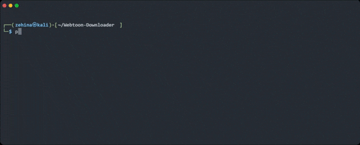
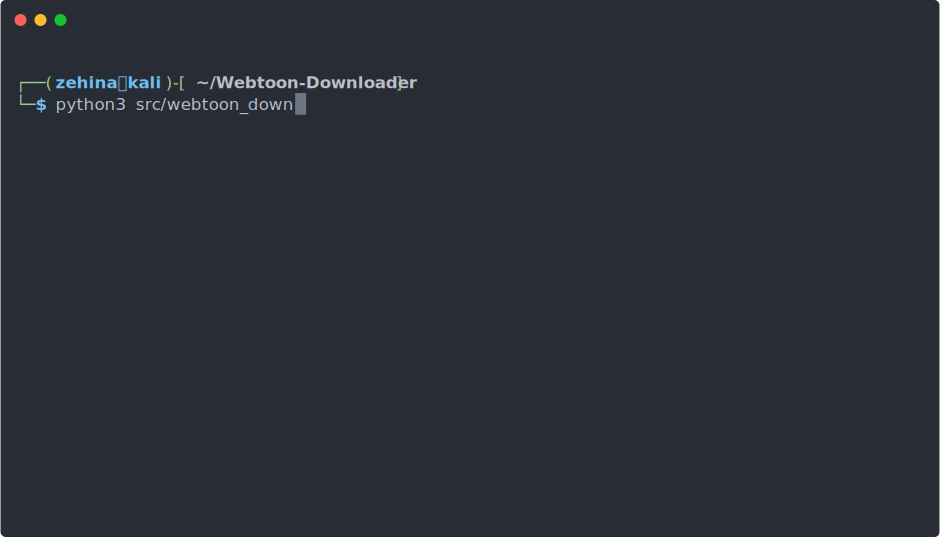

<!-- PROJECT LOGO -->
<br />
<p align="center">

  <h2 align="center">Webtoon Downloader</h2>

  <p align="center">
    A simple tool for downloading chapters of any releases hosted on the webtoons website.
    <br />
    <br />
    <a href="https://github.com/Zehina/Webtoon-Downloader/issues">Report Bug</a>
    ·
    <a href="https://github.com/Zehina/Webtoon-Downloader/issues">Request Feature</a>
  </p>
</p>

<p align="center">
  
</p>


<!-- TABLE OF CONTENTS -->
<details open="open">
  <summary><h2 style="display: inline-block">Contents</h2></summary>
  <ol>
    <li><a href="#supported-sites">Supported Sites</a></li>
    <li>
      <a href="#getting-started">Getting Started</a>
      <ul>
        <li><a href="#compatibility">Compatibility</a></li>
        <li><a href="#installation">Installation</a></li>
      </ul>
    </li>
    <li><a href="#usage">Usage</a></li>
    <li><a href="#contributing">Contributing</a></li>
    <li><a href="#license">License</a></li>
    <li><a href="#contact">Contact</a></li>
    <li><a href="#built-with">Built With</a></li>
  </ol>
</details>


## Supported Sites
* https://www.webtoons.com/

<!-- GETTING STARTED -->
## Getting Started

To get a local copy up and running follow these simple steps.

### Compatibility

Webtoon Downloader is supported on Windows, Linux & OSX. The minimum python version required is: 
* Python >= 3.7

### Installation

1. Clone the repo
   ```sh
   git clone https://github.com/Zehina/Webtoon-Downloader.git
   ```
2. Navigate to the src folder containing the script
    ```sh
    cd Webtoon-Downloader
    cd src
    ```
3. Install required modules
   ```sh
   pip install -r requirements.txt 
   ```

<!-- USAGE EXAMPLES -->
## Usage
* Downloading all chapters of a given title.
    ```ps
    $ python webtoon_downloader.py "www.webtoons.com/en/.../.../list?title_no=...&page=1"
    ```
* Downloading all released chapters starting from chapter 10 until the last released chapter.
    ```ps
    $ python webtoon_downloader.py [url] --start 10
    ```
* Downloading all released chapters until chapter 150.
    ```ps
    $ python webtoon_downloader.py [url] --end 150
    ```
* Downloading all released chapters between chapter 35 and chapter 67, inclusive of both of these chapters.
    ```ps
    $ python webtoon_downloader.py [url] --start 35 --end 67
    ```
* Downloading only the latest released chapter using either ```-l``` or ```--latest```.
    ```ps
    $ python webtoon_downloader.py [url] --latest
    ```
* You can change the format of the downloaded pictures with the ```--images-format``` argument
    ```ps
    $ python webtoon_downloader.py [url] --images-format 'png'
    ```
* By default, the downloaded chapters will be stored under the current working directory with the folder name [series_title]. 
For example, downloading Tower of God, Chapter 150 would result in the following:
    ```ps  
    Tower_of_God
        │--150_001.jpg
        │--150_002.jpg
        │--150_003.jpg
        │...
    ```
* In order to download these images into a different folder, you can use the ```--dest``` optional argument.
    ```ps
    $ python webtoon_downloader.py [url] --dest ./path/to/parent/folder/of/downloaded/images
    ```

* The downloaded images of the chapters are by default all located in the ```[dest]```, however these images can be seperated into seperate directories by providing the ```--seperate``` argument, where each directory corresponds to a downloaded chapter.
    ```ps
    $ python webtoon_downloader.py [url] --seperate
    ```
  For example, downloading Tower of God, Chapter 150 to 152 would result in the following:
    ```ps  
    Tower_of_God
        │150
            │--150_001.jpg
            │--150_002.jpg
            │--150_003.jpg
            │...
        │151
            │--151_001.jpg
            │--151_002.jpg
            │--151_003.jpg
            │...
        │152
            │--152_001.jpg
            │--152_002.jpg
            │--152_003.jpg
            │...
    ```

For more details on positional arguments, please use the ```-h ``` or ```--help``` argument:
```console
py webtoon_downloader.py --help
```

<p align="center">
  
</p>


<!-- CONTRIBUTING -->
## Contributing

Any contributions you make are **greatly appreciated**.

1. Fork the Project
2. Create your Feature Branch (`git checkout -b feature/AmazingFeature`)
3. Commit your Changes (`git commit -m 'Add some AmazingFeature'`)
4. Push to the Branch (`git push origin feature/AmazingFeature`)
5. Open a Pull Request

<!-- LICENSE -->
## License

Distributed under the MIT License. See `LICENSE` for more information.


<!-- CONTACT -->
## Contact

Zehina - zehinadev@gmail.com

Project Link: [https://github.com/Zehina/Webtoon-Downloader](https://github.com/Zehina/Webtoon-Downloader)


<!-- ACKNOWLEDGEMENTS -->
## Built With

* [Rich](https://github.com/willmcgugan/rich) Amazing and beautiful text formatting in terminals.
* [Webtoons](https://webtoons.com) For the accessibility to thousands of free comics.


<!-- MARKDOWN LINKS & IMAGES -->
<!-- https://www.markdownguide.org/basic-syntax/#reference-style-links -->
[contributors-shield]: https://img.shields.io/github/contributors/Zehina/repo.svg?style=for-the-badge
[contributors-url]: https://github.com/Zehina/Webtoon-Downloader/graphs/contributors
[forks-shield]: https://img.shields.io/github/forks/Zehina/repo.svg?style=for-the-badge
[forks-url]: https://github.com/Zehina/Webtoon-Downloader/network/members
[stars-shield]: https://img.shields.io/github/stars/Zehina/repo.svg?style=for-the-badge
[stars-url]: https://github.com/Zehina/Webtoon-Downloader/stargazers
[issues-shield]: https://img.shields.io/github/issues/Zehina/repo.svg?style=for-the-badge
[issues-url]: https://github.com/Zehina/Webtoon-Downloader/issues
[license-shield]: https://img.shields.io/github/license/Zehina/repo.svg?style=for-the-badge
[license-url]: https://github.com/Zehina/Webtoon-Downloader/blob/master/LICENSE.txt
[linkedin-shield]: https://img.shields.io/badge/-LinkedIn-black.svg?style=for-the-badge&logo=linkedin&colorB=555
[linkedin-url]: https://linkedin.com/in/Zehina