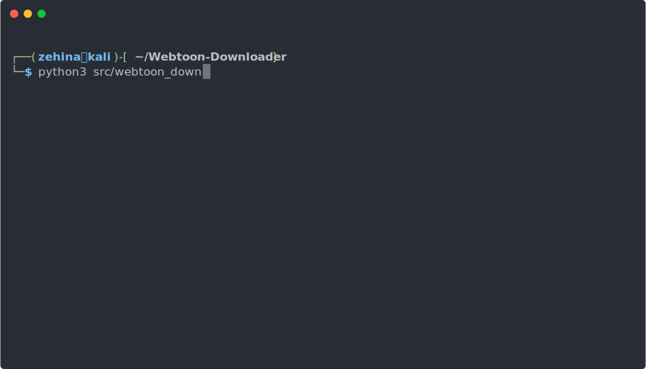

# Webtoon Downloader
<!-- markdownlint-disable -->
<!-- PROJECT LOGO -->
<br />
<p align="center">

  <h2 align="center">Webtoon Downloader</h2>

  <p align="cen">
    A simple tool for downloading chapters of any releases hosted on the Webtoons website.
    <br />
    <br />
    <a href="https://github.com/Zehina/Webtoon-Downloader/issues">Report Bug</a>
    ·
    <a href="https://github.com/Zehina/Webtoon-Downloader/issues">Request Feature</a>
  </p>
</p>

[](https://img.shields.io/github/v/release/Zehina/webtoon-downloader)
[](https://github.com/Zehina/webtoon-downloader/actions/workflows/main.yml?query=branch%3Amain)
[](https://codecov.io/gh/Zehina/webtoon-downloader)
[](https://img.shields.io/github/commit-activity/m/Zehina/webtoon-downloader)
[](https://img.shields.io/github/license/Zehina/webtoon-downloader)

<p align="center">
  
</p>
<!-- markdownlint-enable -->
<!-- TABLE OF CONTENTS -->

## Contents

- [Supported Sites](#supported-sites)
  - [Getting Started](#getting-started)
      -[Compatibility](#compatibility)
      -[Installation](#installation)
- [Usage](#usage)
- [Contributing](#contributing)
- [License](#license)
- [Contact](#contact)
- [Built With](#built-with)

## Supported Sites

- <https://www.webtoons.com/>

<!-- GETTING STARTED -->

## Getting Started

To get a local copy up and running follow these simple steps.

### Compatibility

Webtoon Downloader is supported on Windows, Linux & OSX. The minimum Python
  version required is:

- Python >= 3.7

### Installation

1. Clone the repo

   ```sh
   git clone https://github.com/Zehina/Webtoon-Downloader.git
   ```

2. Navigate to the project folder

   ```sh
   cd Webtoon-Downloader
   ```

3. Install this module in the system and generate a `webtoon-downloader`
   console script for easier usage

   ```sh
   pip install .
   ```

<!-- USAGE EXAMPLES -->

## Usage

- Downloading all chapters of a given title.

    ```shell
    webtoon-downloader "www.webtoons.com/en/.../.../list?title_no=...&page=1"
    ```

- Downloading all released chapters starting from chapter 10 until the last
  released chapter.

    ```shell
    webtoon-downloader [url] --start 10
    ```

- Downloading all released chapters until chapter 150.

    ```shell
    webtoon-downloader [url] --end 150
    ```

- Downloading all released chapters between chapter 35 and chapter 67, inclusive
  of both of these chapters.

    ```shell
    webtoon-downloader [url] --start 35 --end 67
    ```

- Downloading only the latest released chapter using either ```-l``` or
  ```--latest```

    ```shell
    webtoon-downloader [url] --latest
    ```

- You can change the format of the downloaded pictures with the
  ```--images-format``` argument

    ```shell
    webtoon-downloader [url] --images-format 'png'
    ```

- By default, the downloaded chapters will be stored under the current working
  directory with the folder name [series_title].
For example, downloading Tower of God, Chapter 150 would result in the following:

    ```tree
    Tower_of_God
        │--150_001.jpg
        │--150_002.jpg
        │--150_003.jpg
        │...
    ```

- To download these images into a different folder, you can use the ```--dest```
  optional argument.

    ```shell
    webtoon-downloader [url] --dest ./path/to/parent/folder/of/downloaded/images
    ```

- The downloaded images of the chapters are by default all located in the
  `[dest]`, however, these images can be separated into separate directories by
  providing the `--separate` argument, where each directory corresponds to a
  downloaded chapter.

    ```shell
    webtoon-downloader [url] --separate
    ```

  For example, downloading "Tower of God", Chapters from 150 to 152 would result
  in the following:

    ```tree
    Tower_of_God
        │150
            │--150_001.jpg
            │--150_002.jpg
            │--150_003.jpg
            │...
        │151
            │--151_001.jpg
            │--151_002.jpg
            │--151_003.jpg
            │...
        │152
            │--152_001.jpg
            │--152_002.jpg
            │--152_003.jpg
            │...
    ```

- You can additionally export the *summary*, *chapter title* and *author notes*
  into text files. You can select the format for the output as either JSON
  (default) or plain text files or both.

    ```shell
    webtoon-downloader [url] --export-texts [--export-format <json|text|all>]
    ```

  For more details on positional arguments, please use the `-h` or `--help`
  argument:

  ```console
  py webtoon_downloader.py --help
  ```

  

<!-- CONTRIBUTING -->

## Contributing

Any contributions you make are **greatly appreciated**.

1. Fork the Project
2. Create your Feature Branch (`git checkout -b feature/AmazingFeature`)
3. Commit your changes (`git commit -m 'Add some AmazingFeature'`)
4. Push to the Branch (`git push origin feature/AmazingFeature`)
5. Open a Pull Request

<!-- LICENSE -->

## License

Distributed under the MIT License. See `LICENSE` for more information.

<!-- CONTACT -->

## Contact

Zehina - <zehinadev@gmail.com>

Project Link: <https://github.com/Zehina/Webtoon-Downloader>

<!-- ACKNOWLEDGEMENTS -->

## Built With

- [Rich](https://github.com/willmcgugan/rich) Amazing and beautiful text
  formatting in terminals.
- [Webtoons](https://webtoons.com) For the accessibility to thousands of free
  comics.
