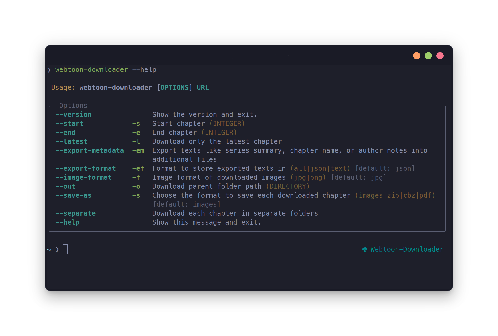

# Webtoon Downloader

Webtoon Downloader is a Python CLI for downloading chapters from [Webtoons](https://www.webtoons.com/) as image folders, ZIP archives, CBZ archives, or PDFs.

It is built for people who want a practical command-line workflow and for contributors who want a codebase that is small enough to understand without reverse-engineering the entire project first.

## What It Does

- Downloads a full series or a selected chapter range
- Saves chapters as `images`, `zip`, `cbz`, or `pdf`
- Supports image quality selection and image format conversion
- Exports metadata such as summaries, chapter titles, and author notes
- Uses async downloads with configurable concurrency and retry behavior
- Provides a terminal progress UI for long-running downloads

## Who This Documentation Is For

This docs site is split into three tracks:

- User docs: installation, commands, output options, and troubleshooting
- Internal docs: downloader architecture, request flow, and storage pipeline
- API docs: module-level reference generated from the code

## Start Here

- New users: [Getting Started](getting-started.md)
- Regular CLI use: [CLI Guide](cli.md)
- Known limitations and common failures: [FAQ](faq.md)
- Project internals: [Architecture](architecture.md)
- Local setup and contributor workflow: [Development](development.md)
- Module reference: [API Reference](modules.md)

## Supported Site

- [https://www.webtoons.com/](https://www.webtoons.com/)

## Project Goals

The project aims to be:

- Fast enough for large downloads
- Transparent about failure modes
- Straightforward to extend
- Reasonable to debug when Webtoons changes upstream behavior

## Important Limitations

Some classes of problems are outside the project’s control:

- Webtoons rate limiting and CDN instability
- Daily Pass and app-only content
- Sudden HTML or API changes on the upstream site

The [FAQ](faq.md) covers those cases in more detail.
